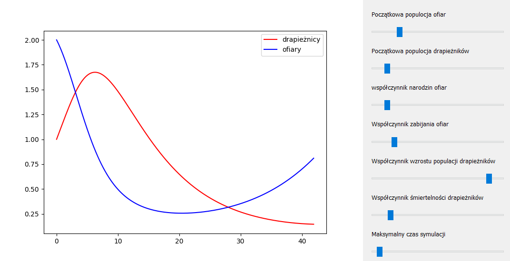
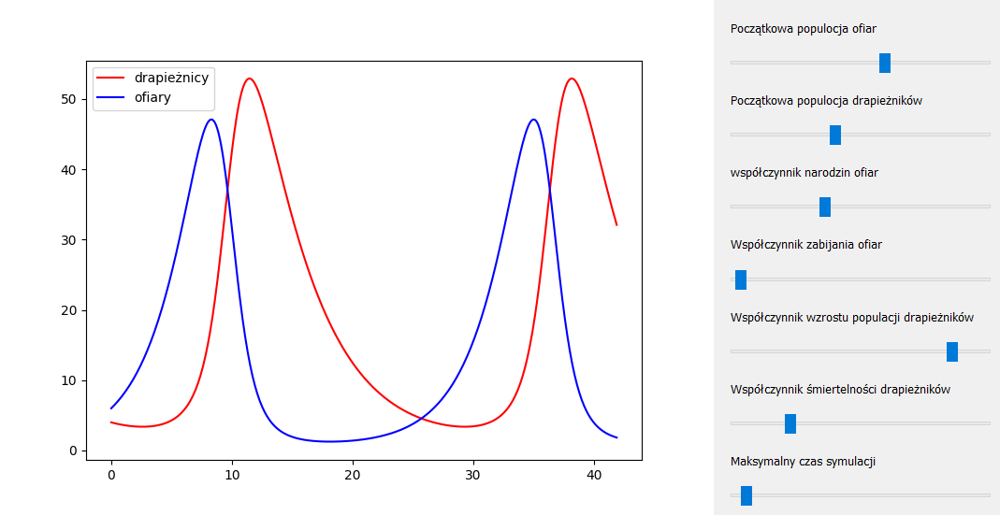

# Visualisation of predator-prey system dynamics
based on the Lotka–Volterra equations. Using python.

## GUI
Project uses PyQt and matplotlib.  
Users can modify ODE parameters and starting conditions via interactive sliders.

## Solved ODE
Visualised predator-pray system dynamics are based on slightly modified Lotka–Volterra equations [Lotka–Volterra equations](https://en.wikipedia.org/wiki/Lotka%E2%80%93Volterra_equations)

### Original equations

where:  
x - prey population  
y - predator population  
a - prey population growth  
b - prey mortality rate due to predation  
c - predator growth rate due to predation  
d - predator mortality rate  

### Modified equations

where:  
x - prey population  
y - predator population  
a - prey population growth  
b - prey mortality rate due to predation  
c - conversion rate of hunted prey to descendants  
d - predator mortality rate  

### Solwing method
ODE are solved  using the Runge Kutta 2nd order method.

## Result

